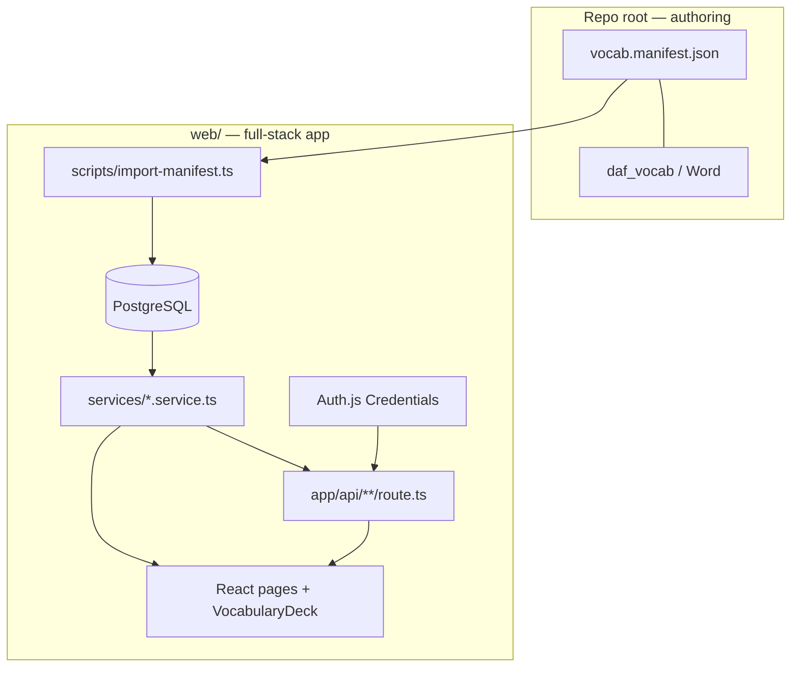

# Backend: full-stack Next.js app in `web/`

The `web/` folder is a **standalone full-stack Next.js application**. It does not read `vocab.manifest.json` at runtime. The repo root (`daf_vocab`, Word, JSON manifests) is **authoring only**.

**Sole bridge:** `npm run db:import-manifest` upserts manifest content into Postgres and assigns `cards.userId` to the default import user.

---

## Architecture



### Layers

| Layer | Path | Role |
|-------|------|------|
| Route handlers | `app/api/**/route.ts` | HTTP: validate (Zod), auth, call service, status codes |
| Services | `services/*.service.ts` | Business logic + Prisma |
| Prisma client | `lib/db/prisma.ts` | DB singleton |
| Auth | `lib/auth/` | NextAuth (Credentials + JWT) |

---

## Data model

| Table | Purpose |
|-------|---------|
| `users` | Accounts (email, password hash) |
| `cards` | Vocabulary content; **`user_id`** = owner |
| `card_glosses`, `card_notes`, `card_examples` | Normalized card children |
| `user_card_progress` | **`user_id` + `card_id`** → studied state (not on `cards`) |
| `lessons`, `lesson_pages` | Lesson hub metadata |

**Two user↔card relationships:**

1. **Ownership:** `cards.userId` — import uses default user; CRUD uses signed-in user.
2. **Progress:** `user_card_progress` — per-user studied flags.

---

## Read path (happy path)

1. Browser opens `/` → `VocabularyDeck` (client).
2. `GET /api/cards?page=1&pageSize=25&lektion=…&sort=deck` → `cards.service.listCards` → Prisma.
3. Response envelope:

```json
{
  "page": 1,
  "pageSize": 25,
  "totalItems": 176,
  "totalPages": 8,
  "items": [ /* EnrichedVocabCard + studied? */ ]
}
```

4. Filter options: `GET /api/cards/filter-options`.
5. Lessons page: Server Component → `lessons.service.fetchLessons()` (or `GET /api/lessons`).

---

## Write path (happy path)

### Runtime (authenticated)

| Action | Route | Service |
|--------|-------|---------|
| Register | `POST /api/auth/register` | `users.service.registerUser` |
| Sign in | `POST /api/auth/callback/credentials` | Auth.js |
| Create card | `POST /api/cards` | `cards.service.createCard` |
| Update card | `PATCH /api/cards/[id]` | `cards.service.updateCard` (owner only) |
| Delete card | `DELETE /api/cards/[id]` | `cards.service.deleteCard` (owner only) |
| Toggle studied | `PATCH /api/cards/[id]/progress` | `cards.service.setCardStudied` |

### Offline (manifest → DB)

```text
Edit vocab.manifest.json (or Word → daf_vocab) → npm run db:import-manifest
```

Import upserts cards with `userId = DEFAULT_IMPORT_USER_*`; does not touch progress.

---

## Auth

- **NextAuth v5** with **Credentials** provider and **JWT** sessions.
- Env: `AUTH_SECRET`, `AUTH_URL`, `DATABASE_URL`.
- Pages: `/login`, `/register`.
- Studied filter and progress PATCH require sign-in.

---

## API conventions

- List endpoints: paginated envelope (`lib/api/types.ts`).
- Filters/sort: query params only (`lib/api/schemas.ts`).
- Invalid input → `400`; unauthenticated mutation → `401`; wrong owner → `403`.

---

## Local setup

```powershell
docker compose up -d          # repo root
cd web
cp .env.example .env          # set AUTH_SECRET
npm install
npm run db:migrate            # or db:push
npm run db:import-manifest
npm run dev
npm run test:e2e
```

---

## What is outside `web/`

- `vocab.manifest.json`, `daf_vocab`, Python/GitHub Pages preview — unchanged authoring flow.
- No `USE_JSON_MANIFEST` runtime mode in the Next app.

---

*See also: `.cursor/rules/daf-web-*.mdc`, `docs/web-refactor-prompt.md`.*
